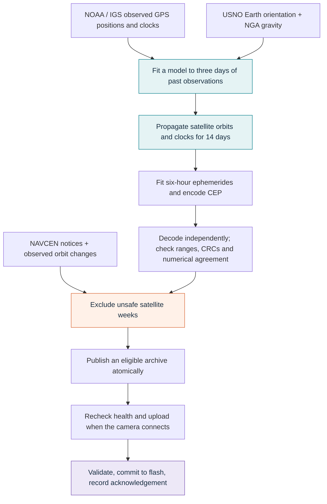
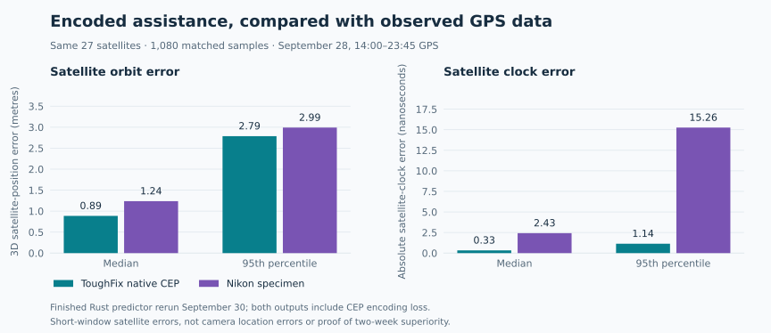
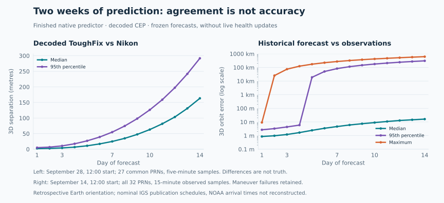
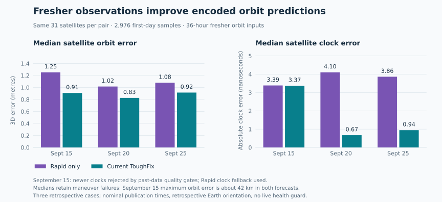

# ToughFix

**Fresh GPS assistance for an Olympus Tough TG-1, automatically, on Linux.**

ToughFix downloads public GPS satellite observations, calculates its own
14-day orbit and clock predictions, and updates your camera when you plug it
in. A window and system tray show camera status, prediction freshness, and
upload progress. The app and installer are written in Rust; neither Olympus's
updater nor any outside prediction service is needed.


## Why this exists

A used TG-1 still takes pictures just fine. Its GPS also works, but it asks for
prediction data to help it find a position faster. The original updater did
not support Linux, and assistance updates for this model were discontinued.
A working camera had lost a useful feature because its supporting service
had gone away.

ToughFix restores that feature and makes it automatic. Connect the camera,
let the app calculate and commit fresh assistance, and take it back outside.
The name means **Tough** for the camera, **Fix** for a GPS fix, and also for
fixing the thing that stopped working.

Assistance gives the GPS receiver advance information about satellite orbits
and clocks. It helps acquisition; the camera still determines its position
from received GPS signals. ToughFix does not supply a fixed location or replace
the camera's normal GPS operation.

## Install and use

You need Linux, Rust 1.92 or newer, a C toolchain, `pkg-config`, and development
packages for GTK 4 and Libadwaita 1.4 or newer. On Arch Linux the build prerequisites
are `rust`, `base-devel`, `pkgconf`, `gtk4`, and `libadwaita`. Automatic camera launch also needs systemd
and an active graphical session. The tray uses StatusNotifierItem, supported
by desktops such as KDE and by Waybar configurations with a tray.

From the checkout, as your ordinary desktop user:

```sh
make install
```

The same command installs updates. It builds the locked release and installs
the binary, icon, application-menu entry, and camera-triggered user service.
The first camera-access setup asks for sudo to install a TG-1-specific udev
rule and load the Linux `sg` driver. Subsequent camera connections and normal
app updates do not require sudo once that setup is in place.
**Do not run `sudo make install`.**

1. Reconnect the camera after installation and choose **USB Storage** mode.
2. ToughFix starts in the background, refreshes its inputs, and automatically
   uploads a changed eligible forecast. If the desktop has already mounted the
   card, ToughFix briefly unmounts it for this initial check/update, then mounts
   it again, ready for browsing and copying photos.
   You can also launch it from the
   application menu and open its dashboard from the tray.
3. Wait for the camera operation to finish. **An amber tray icon means do not
   unplug.** Eject any mounted camera storage before disconnecting.

The tray exists only while a camera is connected. Clicking it opens the window;
its menu offers Open and Quit. After the initial check, automatic camera commands
stop for the rest of that USB connection, so browsing and copying photos can
continue uninterrupted. Mounted
storage statistics come from Linux filesystem information. Camera health and
battery readings are timestamped snapshots from a camera session. A forecast
matching that camera's last acknowledged commit skips the upload. Identical
USB and PTP serial numbers also identify older upload records. One health and
battery reading happens before storage mounts; no periodic camera polling
occurs while browsing. Timestamped snapshots are saved for the next launch. The dashboard shows camera communication status,
reported battery level, storage and mounts, observation source and age,
prediction coverage and statistics, upload progress, and the last acknowledged
commit associated with that camera.
Live activity and progress stay pinned above the scrolling content. The main
view shows the camera, its health and SD card capacity, and a GPS assistance
summary. A battery-shaped gauge colors the reported level green, amber, or
red; its bolt indicates USB connection, not a verified charging state. An SD
card graphic shows capacity alongside a storage-use bar and free space.
Snapshot age appears beside health and beneath the battery gauge. The camera
refresh icon reads new battery, health and SD-card information on request,
briefly unmounting and remounting the card. A busy card is left alone, and this
refresh does not upload GPS predictions.
**Camera**, **Advanced**, and **Settings** are tabs in the same window, with preferences,
observation ages, model statistics, hashes, upload history, and diagnostics.
Native Libadwaita navigation appears in the header, moving to a bottom bar in
narrow windows. Status and progress remain visible on every view.
The main window defaults to a compact floating window on Hyprland; other
desktops use their normal placement policy. Download stages show animated progress; orbit
calculation reports completed satellites, and uploads report transferred bytes.

**Settings → Start when camera connects** controls automatic launching.
**Update automatically when connected** controls uploads. Both are enabled
by default. There is no login autostart requirement. Closing the window hides it while connected and quits when no camera is
connected. Hidden instances exit after disconnection; an open dashboard stays available.
The TG-1-specific udev rule holds desktop automount while the initial update
runs; ToughFix then mounts the card through UDisks2. Failed refreshes release
the hold, and a 90-second initial wait limit releases it if downloads or prediction
generation take too long. Startup disabled or an app failure also releases storage
through service cleanup. This requires UDisks2. If an automounter ignores the
hint, ToughFix requests one normal unmount at startup. A busy card cancels that
connection's initial check; no forced unmount or periodic retry occurs. A card
mounted again after preparation is also left alone until the next connection.

Inputs refresh at startup and hourly while the app is running; failures retry
after five minutes. A new full forecast took **about 40 seconds** with four
workers on a Threadripper 2950X, excluding downloads. Unchanged inputs reuse
the forecast. Each USB connection permits one automatic upload; further updates
during a long connection use the upload button after unmounting storage.
**Refresh satellite data** refreshes predictions without repeating camera status
queries. No Python, virtual environment, or source checkout is needed
by the installed application.

For custom paths, installation without system setup, or desktops with a different
session configuration, see the [installation guide](desktop/README.md#install-or-update).
App data live in `$XDG_STATE_HOME/toughfix`, normally `~/.local/state/toughfix`.

## How ToughFix was built

The investigation started with an attempt to retrieve the camera's existing
assistance file. With no verified readback path, attention turned to the
original updater, then the camera firmware, to understand the protocol and
file format. AI tools were used to disassemble and analyze the original updater
and camera firmware.

1. **Inspect the old updater without running it.** Static inspection of an old
   Windows installer traced its executable and camera-interface DLL.
   The utility downloads an opaque server-generated file rather than calculating
   predictions. Its camera protocol uses PTP-style containers carried inside
   vendor SCSI commands, not a file copied to the SD card.
2. **Recover the receiver's file reader.** The updater explained how to send
   the data, but not how to generate it. The next step was to locate the official
   TG-1 1.1 firmware update image. Its blocks were decoded using
   the previously documented Olympus obfuscation scheme, with internal checksums
   verified. Disassembly of the camera's AM33 code and embedded big-endian
   Xtensa GPS code exposed the
   archive layout, signed bit fields, orbital coefficients, clocks, CRCs,
   reference times, and validity rules. No vendor executable or firmware was
   executed, and no replacement firmware was flashed.
3. **Find an independent specimen.** A real file was needed to validate
   the reconstructed reader. A preserved Nikon `NML_28A.ee` assistance
   file matched the recovered format. It exposed incorrect assumptions that
   synthetic examples had missed. The decoder can read and rewrite the
   specimen byte for byte; its decoded satellite positions also agree with
   independent public orbit observations. This established a useful format
   reference, without assuming Nikon and Olympus have the same supplier.
4. **Generate independent predictions.** Nikon's file offered a possible source
   of assistance data. The goal, however, was to generate predictions from public
   orbital observations and avoid depending on another manufacturer's feed.
   A Python research implementation was checked against Nikon and held-out
   observations, then the operational pipeline was implemented in Rust. Nikon
   coefficients and predictions are never training inputs.

The recovered format is documented [below](#cep-file-format). Its implementation
is in the [encoder](src/predictor/cep.rs), [independent decoder](src/predictor/validation.rs),
and [camera transport](src/camera.rs).

## How the predictions work

### Public inputs

ToughFix predicts **GPS** satellites, PRNs G01–G32. GNSS is the broader category
of satellite-navigation systems; this implementation does not use GLONASS.
IGS, the **International GNSS Service**, combines measurements and analysis
from a worldwide network to produce precise satellite orbit and clock products.

| Input | Public source | Role in the model |
| --- | --- | --- |
| Observed GPS positions and clocks | IGS products distributed through [NOAA's public archive](https://www.ngs.noaa.gov/CORS/data.shtml) | Three days of 15-minute observations: Rapid preferred on overlap, observed Ultra-rapid extends the arc; also used for health checks |
| Earth's gravity field | [NGA EGM96](https://earth-info.nga.mil/index.php?dir=wgs84&action=wgs84) | Gravity coefficients through degree and order 8 |
| Earth orientation | [US Naval Observatory](https://maia.usno.navy.mil/) | Polar motion and UT1−UTC for Earth-fixed/inertial transformations |
| Satellite health and maneuver notices | [US Coast Guard NAVCEN](https://www.navcen.uscg.gov/gps-nanus-almanacs-opsadvisories-sof) | Outage, maintenance, and maneuver quarantine |

NOAA distributes the orbit products; it is not their sole producer. Predicted
samples in source SP3 products are rejected. Downloads have recorded source
URLs, retrieval times, sizes, and SHA-256 hashes. The NGA archive is read only
for its gravity coefficient text; its included programs are never run.



### Fit, then propagate

ToughFix transforms measured Earth-fixed positions into an inertial frame using
ERFA and explicit GPS/UTC/TAI/TT time conversions. For each satellite, a
least-squares fit estimates its initial position and velocity plus five
solar-radiation-pressure coefficients from the three-day observation arc.

The force model includes Earth's nonspherical gravity, differential attraction
from the Sun and Moon, and sunlight pressure using a reduced ECOM model with
an Earth-shadow/penumbra transition. The engine numerically integrates that model
forward with DOP853. This is a physical orbit forecast, rather than extending
a polynomial through old satellite positions.

Observed Ultra-rapid products extend the fitting arc toward the present instead
of waiting for the daily Rapid release. Each Ultra-rapid file contains 24 hours
of observations and 24 hours of supplier predictions; only its observed half
is eligible, with prediction flags checked separately. Rapid wins when both
products supply an observation at the same epoch. Several Ultra-rapid products
are fetched to avoid leaving a gap behind the newest file. Rapid's normal
publication schedule can leave its newest observations 17–41 hours old;
the fitting-data limit is 48 hours, while the independent health checks still
require observations within 36 hours and an upload-time health check within
one hour. The dashboard shows health-observation and fitting-data ages separately.

Satellite clocks need predictions too. Linear and quadratic clock models are
tested using an earlier part of the same past-only observation arc. A quadratic
is selected only when it materially improves the held-out past-day prediction;
the selected model is refitted to the full three days. Future observations never
select or fit either the orbit or clock model.

Clock inputs have a separate quality decision for each satellite. A newer
observed clock fit is accepted when its residual RMS is at most
`max(1 ns, 2 × Rapid RMS)` and its largest residual step is at most
`max(5 ns, 4 × Rapid step)`. Otherwise the predictor uses the recent Rapid clock
fit, reanchored to the orbit forecast's time reference. A fallback's newest
sample must be within 48 hours of that reference; without one, the newer fit
must meet the fixed 1 ns / 5 ns limits or the satellite is excluded. These
residual gates are conservative heuristics, not guaranteed future accuracy.
Health guarding includes the older clock training interval too, so a newer
orbit fit cannot silently rehabilitate pre-maneuver clock inputs.

### Turn trajectories into something the camera can read

The GPS receiver expects **CEP**, a packed prediction format. ToughFix approximates
the propagated trajectory with broadcast-style ephemerides in six-hour arcs,
then encodes weekly polynomial trends and per-interval residuals, together with
satellite-clock coefficients. The polynomial trends are a compression step,
not the orbital propagation model.

The archive is 130,720 bytes: four weekly blocks with 32 satellite slots and
a CRC per block. The TG-1 uses a two-week window, so only the first two blocks
contain predictions; weeks three and four are explicitly unavailable.
An independent decoder checks the actual serialized values, not just the
floating-point values supplied to the encoder.

## How does it compare with Nikon?

The evaluation separates **accuracy against observations**, **agreement
between forecasts**, and **numerical implementation correctness**. Mixing them
would make the results sound stronger than they are.

### Measured short-term accuracy, including the file encoding

The finished Rust predictor was rerun on September 30, 2026 with the new
observed Ultra-rapid extension and clock-quality policy. Its September 28
forecast starts at 12:00 GPS; Nikon's specimen starts at 14:00 GPS.
The comparison covers **27 common satellites and 1,080 matched samples from
14:00 to 23:45 GPS**, against held-out observed IGS Rapid data. Both assistance
files are decoded through the CEP representation, so encoding loss is included.



| Error against the same observed reference | ToughFix native CEP | Nikon specimen |
| --- | ---: | ---: |
| Median 3D satellite-position error | 0.887 m | 1.238 m |
| 95th-percentile position error | 2.786 m | 2.991 m |
| Maximum position error | 7.896 m | 8.448 m |
| Median satellite-clock error | 0.332 ns | 2.425 ns |
| 95th-percentile clock error | 1.140 ns | 15.262 ns |

ToughFix had lower orbit and clock errors by these measures in this window.
These are **satellite errors, not camera-location errors**. One nanosecond of
clock error corresponds to about 0.30 metres of range error; the resulting
camera-position error depends on satellite geometry and the receiver's
measurements. Absolute clock comparisons also include clock-datum differences;
a receiver can absorb a common constellation offset into its own clock bias.

The inputs were restricted to past observations; newer Rapid data were reserved
for evaluation. Historical input availability follows nominal IGS publication
schedules, but NOAA's archive arrival times were not reconstructed. Earth
orientation is retrospective. Nikon's training cutoff and current prediction
producer are unknown, as is whether Olympus used exactly the same predictions.
**A two-week accuracy advantage over Nikon has not been demonstrated.**
The [benchmark summary](docs/figures/benchmark-data.json) includes the values
behind these comparisons and the graphs.

### Two weeks: differences grow, and maneuvers matter

ToughFix's September 28 **decoded CEP** differs from Nikon's decoded assistance
by a median 1.86 m during day 1, 24.88 m during day 7, and 163.35 m during day 14.
After the observed reference ends, these are two predictions disagreeing; they
do not identify which one is closer to the real satellite.

A separate native forecast trained on September 11 at 12:00 through September 14
at 11:45 GPS and was tested against held-out September 14–28 observations.
Its median decoded satellite-position error reached 16.13 m during day 14.
The raw result also contains maneuver failures as large as **616 km**. Those
failures remain in the report: an old orbit cannot predict a later commanded
satellite maneuver.



This is a retrospective orbit-model benchmark, not a complete replay of the
live service. Its frozen forecast lacks ongoing health refreshes. Today's app
checks fresh notices and observed discontinuities, removes affected satellite
weeks, and requires a new fit for recovery. The historical run used Rapid clock
fallbacks; its day-14 median clock error was 39.52 ns, about 11.8 m of range error.

The [health policy](src/predictor/health.rs) implements notice resolution,
observed-change detection, and removal of unsafe records.

### Does using fresher observations help?

Three paired native forecasts simulated updates on September 15, 20, and 25.
Observed Ultra-rapid extended each orbit fit by 36 hours beyond the latest
available Rapid observations. The comparison uses the same 31 satellites and
2,976 held-out samples per case during the following 24 hours, with both
outputs decoded from their CEP files.

| Simulated update | Rapid-only median orbit error | Current ToughFix median orbit error | Rapid-only median clock error | Current ToughFix median clock error |
| --- | ---: | ---: | ---: | ---: |
| September 15 | 1.252 m | 0.908 m | 3.386 ns | 3.371 ns |
| September 20 | 1.016 m | 0.827 m | 4.104 ns | 0.669 ns |
| September 25 | 1.079 m | 0.915 m | 3.863 ns | 0.944 ns |



Median encoded orbit errors improved by 15–28%. The September 15 clock inputs
failed the newer-data residual gates, so Rapid clock fallbacks preserved clock
performance; the other cases mostly used newer clocks. These are three cases,
not a broad statistical validation. Publication schedules are simulated, Earth
orientation is retrospective, and no live health guard is applied. September
15 includes a later maneuver with about **42 km maximum orbit error in both
forecasts**, despite the better medians.

### Check the numerical implementation separately

Each production forecast is integrated with a maximum 30-second step and checked
against a separate 60-second run. An optional independent fixed-step RK4 audit
checked all 32 satellites at 57 six-hour epochs: its trajectory differed from
production DOP853 by at most **7.34 mm** in the September 30 run. These checks
test the numerical solution of the chosen force model; they cannot prove that
the model includes every real-world force or predicts future maneuvers.

Independent decoding of the revised native CEP found about **1.40 m RMS**
representation error against the numerical trajectory across two weeks.
That error is distinct from the forecast's error against future observations.
The [independent audit](src/predictor/audit.rs) and
[integrator patch notes](vendor/ode_solvers/TOUGHFIX-PATCH.md) describe these checks.

## Camera writes and health checks

Uploads are blocked when sources are stale or malformed, a refresh fails,
predictions have expired, file checks fail, or too few usable satellites remain.
Maneuver and outage handling follows notice references, cancellations,
rescheduling, and observed orbit changes. An old quarantined forecast is never
silently restored to service without a new fit.

Immediately before transfer, ToughFix freezes the exact bytes and rechecks
health, validity, hash, CRCs, and decoded ranges. It sends the recovered
`0x9128`–`0x912c` prepare/chunk/validate/poll/commit sequence through `/dev/sg*`.
It does not perform ordinary filesystem or sector writes to the camera.
Failed uploads are not automatically retried; interrupted operations require
reconnection. Quit waits for an active camera operation to finish.

The dashboard's last commit is an acknowledged, camera-associated receipt.
**There is no verified assistance-file readback command.** A receipt records
what the camera acknowledged committing; it cannot prove the file is still present
after a later camera reset or battery removal.

Only the **Olympus TG-1** is currently supported. Static format analysis used
TG-1 firmware 1.1; the documented successful camera trial used firmware 1.00.
Other Tough models and GPS chipsets may use different formats or protocols.

## CEP file format

This describes the newer 32,680-byte weekly layout emitted by ToughFix for the
TG-1. It is sufficient to follow the encoder and decoder without the original
research archive. The older 32,200-byte layout is not implemented.

<details>
<summary>Binary layout, packed fields, and evaluation rules</summary>

### Archive and weekly blocks

A ToughFix archive contains **four consecutive weekly blocks**, totaling
130,720 bytes. Each block is:

```text
6-byte header + 32 × 1,021-byte satellite records + 2-byte CRC
```

| Block offset | Size | Meaning |
| --- | --- | --- |
| 0 | 4 bytes | Unsigned big-endian block start, in GPS seconds since 1980-01-06 |
| 4 | 1 byte | Zero-based week index: 0, 1, 2, 3; not a week count |
| 5 | 1 byte | Format selector; ToughFix writes 4 |
| 6 | 32 × 1,021 bytes | Fixed slots for GPS PRNs 1–32 |
| 32,678 | 2 bytes | Big-endian CRC-16/XMODEM of the preceding 32,678 bytes |

Successive block starts advance by 604,800 seconds. GPS time is continuous;
do not treat these timestamps as Unix time or silently replace them with UTC.
The TG-1 receiver uses the half-open interval `origin <= time < origin + 1209600`.
ToughFix supplies predictions only in weeks 0 and 1 and marks every record in
weeks 2 and 3 unavailable.

CRC parameters are polynomial `0x1021`, initial value 0, no reflection, and no
final XOR. The check value for ASCII `123456789` is `0x31c3`. Appending the
big-endian CRC makes each block's CRC residue zero; the four-block concatenation
also has zero residue. There is no additional whole-file checksum field.

### Satellite records

Slot `prn` in week `w` starts at `w * 32680 + 6 + (prn - 1) * 1021`.
Each record has a 12-byte prefix followed by 1,009 packed bytes:

| Record offset | Size | Meaning |
| --- | --- | --- |
| 0 | 1 byte | PRN in an available record |
| 1 | 1 byte | Availability/status: zero permits use; nonzero disables the record |
| 2 | 4 bytes | Signed big-endian clock coefficient `af0`, scaled by `2^-40` seconds |
| 6 | 3 bytes | Signed big-endian `af1`, scaled by `2^-50` seconds/second |
| 9 | 2 bytes | Signed big-endian `af2`, scaled by `2^-64` seconds/second² |
| 11 | 1 byte | Meaning not established; ToughFix writes zero |
| 12 | 1,009 bytes | Packed orbital parameter groups |

ToughFix's canonical unavailable record is all zero except byte 1, which is
`0xff`. An available record's PRN must match its slot.

### Bit packing and parameter scales

Fields are read **most-significant bit first** within each byte. All packed
coefficient and residual fields use signed two's-complement integers, including
the 34-bit fields. There is no padding between groups. Each of 15 groups contains:

```text
q0:34 bits, q1:34 bits, q2:24 bits, q3:20 bits
a:4 bits, b:4 bits
28 signed residuals, each with the width listed below
```

| Group | Parameter | Residual bits | Final scale and unit |
| --- | --- | ---: | --- |
| 0 | sqrt(A) | 16 | `2^-19` m^½ |
| 1 | Eccentricity | 16 | `2^-33`, dimensionless |
| 2 | Inclination | 16 | `2^-31` semicircles |
| 3 | Ascending node | 16 | `2^-31` semicircles |
| 4 | Mean anomaly | 24 | `2^-31` semicircles |
| 5 | Argument of perigee | 24 | `2^-31` semicircles |
| 6 | Inclination rate | 12 | `2^-43` semicircles/second |
| 7 | Ascending-node rate | 16 | `2^-43` semicircles/second |
| 8 | Mean-motion correction | 12 | `2^-43` semicircles/second |
| 9 | Crc | 12 | `2^-5` metres |
| 10 | Crs | 12 | `2^-5` metres |
| 11 | Cic | 12 | `2^-29` radians |
| 12 | Cis | 12 | `2^-29` radians |
| 13 | Cuc | 12 | `2^-29` radians |
| 14 | Cus | 12 | `2^-29` radians |

The residual widths sum to 224 bits across the groups, so the stream consumes
exactly `15 * 120 + 28 * 224 = 8072 bits = 1009 bytes`.

For interval `j` from 0 through 27, evaluate each group's raw value as follows,
then apply that group's final binary scale:

```text
root0 = first group's q0 * 2^-19
phase = sqrt(398600500000000) * (j * 21600) / root0^3
P(j) = ((q3 / 256 * j + q2) * j + q1) * j + q0
raw(j) = P(j) + residual[j] + (a * sin(phase) + b * cos(phase)) / 4096
```

`root0` is the first group's initial polynomial coefficient, not the evaluated
sqrt(A) for interval `j`. ToughFix writes zero for the optional periodic `a`
and `b` terms, but the decoder supports nonzero values. Groups 2–8 convert
from semicircles to radians by multiplying by π; groups 11–14 are already
in radians. Crc and Crs are radial harmonic corrections, not checksum fields.

### Time references, clocks, and the node adjustment

Each week contains 28 six-hour intervals. For a request in a populated week:

```text
j = floor((requested_time - block_start) / 21600)
reference = block_start + j * 21600 + 10800
tk = requested_time - reference
```

The clock polynomial's stored reference is `block_start + 10800`. Reanchor it
to interval `j` using `tau = j * 21600`:

```text
af0_ref = af0 + af1 * tau + af2 * tau^2
af1_ref = af1 + 2 * af2 * tau
af2_ref = af2
clock(tk) = af0_ref + af1_ref * tk + af2_ref * tk^2
```

Do not add another 10,800 seconds to `tau`. The clock model follows the GPS
broadcast polynomial convention; the receiver's separate periodic relativistic
correction must not be added a second time to these coefficients.

After conversion to radians, the ascending node needs the recovered reference
adjustment before applying the ordinary GPS broadcast Kepler equations:

```text
d = (reference - 630763200) / 86400
theta(reference) = ((-9.253097568194336e-24 * d + 5.0752099941135916e-15)
                    * d + 6.300388098984894) * d + 4.894961212823059
Omega(t) = packed_node - theta(reference)
           + (node_rate - 7.2921151467e-5) * tk
```

Preserve this routine's GPS-time convention. Replacing it with an arbitrary
UTC sidereal calculation changes the reference frame. The rest of the position
calculation, including the harmonic corrections, is implemented in
[`cep::position`](src/predictor/cep.rs).

The [independent reader](src/predictor/validation.rs) and
[encoder fixtures](tests/fixtures/README.md) provide executable examples.
These describe the packed mathematical representation, not a bit-exact emulation
of every receiver floating-point operation or its final internal ephemeris packet.

</details>

## Development and reproducibility

```sh
make check                # Rust tests and Clippy; no camera access
cargo build --release --locked
./target/release/toughfix --demo       # Simulated camera, GUI and tray
./target/release/toughfix refresh      # Full data/prediction pipeline; no camera access
./target/release/toughfix refresh --offline # Cached inputs; freshness still enforced
```

The native checks cover protocol framing and commit order, independent CEP
decoding, health lifecycles, stale-data rejection, atomic publication,
camera-associated receipts, and installation. CI runs the checks and a locked
release build on Rust 1.92 and stable, plus a weekly dependency-advisory audit.
Tests do not need a camera or the private investigation archive.
`toughfix predict` supports offline experiments;
`toughfix audit` runs the separate RK4 check.

The repository contains the Rust application, test fixtures, desktop integration,
and documentation. It does not include the investigation archive, downloaded
firmware or updater binaries, private camera captures, or large orbit datasets.
The app downloads its own public baseline data. Each generation records input
hashes and model statistics in its state directory.

The README graphs are reproducible from the compact
[benchmark summary](docs/figures/benchmark-data.json) using
[docs/generate_figures.py](docs/generate_figures.py) and Matplotlib. Python is
only needed to regenerate those figures, not to build or run ToughFix.

Headless experiments use the same native implementation:

```sh
toughfix predict --data-dir PATH --forecast-start YYYY-MM-DDTHH:MM:SS --output-prefix PATH/native
toughfix audit --data-dir PATH --prefix PATH/native
```

`predict` expects observed GPS Rapid SP3 files (`IGS0OPSRAP_*.SP3.gz`),
optionally observed Ultra-rapid products (`igu*.sp3.gz`),
`finals2000A.all`, and `egm96.zip`, as downloaded by `refresh`. Forecast-start
timestamps use GPS calendar time. `--rapid-only` disables the Ultra-rapid
extension for controlled comparisons. Prediction artifacts include CEP bytes,
metrics, and diagnostic trajectories. `audit` compares those saved trajectories
with a separate fixed-step RK4 integration; neither command accesses a camera.

## License and acknowledgements

Original ToughFix code, documentation, and generated figures are
**[MIT licensed](LICENSE)**. Public datasets and dependencies retain their own
terms; see [NOTICE.md](NOTICE.md). Vendor firmware and Nikon assistance files
are not included or required by the application.

ToughFix builds on public IGS products, NOAA distribution, USNO Earth orientation,
NGA gravity, NAVCEN notices, ERFA, and the open-source Rust numerical and desktop
libraries. Earlier community documentation in the
[CHDK discussion of Olympus firmware decoding](https://chdk.setepontos.com/d/2471-olympus-emjustylus-series-fw-analysis)
helped make the static investigation possible.
ToughFix is an independent project, unaffiliated with Olympus, OM Digital
Solutions, or Nikon.
